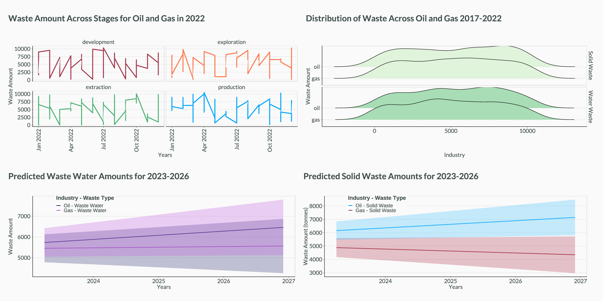

# 🛢️Oil and Gas Dashboard
I developed a static dashboard showcasing the waste amounts and values (solid and water) for a ficticious oil and gas company that has been in operation since 2017.

I created the data and used it to predict the solid and water waste for the oil and gas departments for 2023 to 2026. 

The graph on the top left shows the changes in waste for each of the production stages for both oil and gas in 2022. All production stages have uneven waste with April 2022 having the lowest waste in the 'production' stage. High levels of waste for oil and gas development were observed in the winter months of June - July 2022. 

The graph on the top right shows the distribution of solid and water waste for the oil and gas departments. The oil department has similar outputs of solid and water waste, with numbers around 10,000 tonnes. For the gas department the outputs for solid and water water are around 5,000 tonnes. 

Finally the two bottom graphs show predictions of how water and solid waste will continue for 2023-2026. This can help the company develop strategies that reduce or recycle the waste, and translate this into cost reduction and potentially profit. 

